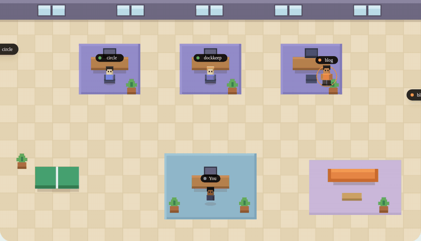

<p align="center">
  <!-- The demo GIF IS the readme. This one is rendered from the site's
       hero room, which shares the app's geometry, palette and timings —
       to re-record from the real app instead, use Debug → Show
       Simulation Panel (⇧⌘D). -->
  
</p>

<h1 align="center">Roster</h1>

<p align="center">
  <strong>Your coding agents, in a room. They come to your desk when they're done.</strong>
</p>

<p align="center">
  <a href="LICENSE"></a>
  
  <a href="https://github.com/ln-dev7/roster/releases/latest"></a>
</p>

Roster is a macOS app that shows your coding agents — Claude Code,
Gemini CLI, Cursor and Codex — as little 3D voxel colleagues in a cozy
pixel office, one desk per session, always.
They work at their desks. They stand up when they need you. And when one
finishes a real piece of work, it gets up, crosses the room, and waits
at your desk. Click anyone for its profile card, wander around with the
arrow keys, zoom when the room gets crowded.

Not a dashboard. No lists, no columns, no diffs — other tools do that
well. Roster is the ambient version: you don't read it, you glance at
it. The state of the room *is* the state of your agents.

## How it works

Three small pieces, all local. With your consent, Roster wires every
agent it finds — hooks in each Claude Code and Gemini CLI settings,
Cursor's hooks.json, Codex's notify — every config backed up first;
every session event is appended to a local spool file that Roster tails —
it even catches up on what happened while it was closed. A read-only
transcript scan makes sessions appear automatically before any of that,
and multiple accounts (`CLAUDE_CONFIG_DIR` aliases) are supported out of
the box.

**Privacy:** Roster never reads your code — only session events. No
server, no account, no telemetry. Updates come through Sparkle against
`roster.lndev.me` — one signed check a day, no system profiling, and
nothing ever installs without your click.

## Install

Download the latest
[`Roster.dmg`](https://github.com/ln-dev7/roster/releases/latest/download/Roster.dmg)
— signed with a Developer ID and notarized by Apple. Requires macOS 14+.

Or build from source:

```sh
brew install xcodegen
git clone https://github.com/ln-dev7/roster.git
cd roster/app
xcodegen
open Roster.xcodeproj   # ⌘R
```

## Contributing

MIT, and gladly. Read [CONTRIBUTING.md](CONTRIBUTING.md) — the scope
test for any change is *"does it improve the GIF?"* — and pick a
[good first issue](https://github.com/ln-dev7/roster/issues?q=is%3Aissue+is%3Aopen+label%3A%22good+first+issue%22).

## Repository layout

```
app/      the macOS app (Swift, SwiftUI, XcodeGen)
site/     roster.lndev.me (Next.js, /en and /fr)
shared/   assets shared between app, site and dmg
scripts/  build, release, icon and dmg tooling
docs/     decisions log, testing pass, issue drafts
```

## License

MIT — © 2026 [LN](https://lndev.me). Also by LN:
[DockKeep](https://dockkeep.lndev.me).
